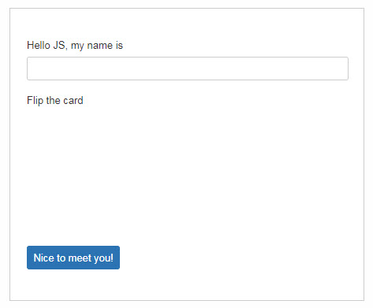
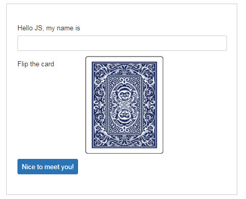

= ScoutJS Custom field =
This cheat sheet shows how to implement your own custom control for a ScoutJS application. In this example we will write a FlipCard field, which allows you to have a 'card' with a front and back side. Clicking on the card should flip the card from one to the other side.

=== Files

===== Create an empty JavaScript file and Stylesheet

* `src/main/js/hellojs/*custom/FlipCard.js*` The java script file representing the field.
* `src/main/js/hellojs/*custom/FlipCard.less*` Styling of the field.

=== Add the files to the application

===== Include the JavaScript file to the module

hellojs-module.js
[source,js]
----
(function(hellojs, scout, $, undefined) {
  ...
  __include("hellojs/custom/FlipCard.js");
  ...
}(window.hellojs = window.hellojs || {}, scout, jQuery));
----

===== Include the Stylesheet to the module

hellojs-module.less
[source,css]
----
...
@import "hellojs/custom/FlipCard.less";
...
----

=== Minimal Code for a new FormField

===== Create a minimal FormField
The FlipCard will inherit from FormField which has already a label and field container.

FlipCard.js
[source,js]
----
hellojs.FlipCard = function() {
  hellojs.FlipCard.parent.call(this);
};
scout.inherits(hellojs.FlipCard, scout.FormField);

hellojs.FlipCard.prototype._render = function() {
  // create the field container
  this.addContainer(this.$parent, 'flip-card');
  // create a label
  this.addLabel();

  // create a field
  var $field = this.$parent.appendDiv('content');
  // add the field to the form field.
  this.addField($field);
  this.addMandatoryIndicator();
  this.addStatus();
};
----

===== Add the FlipCard to the HelloForm

HelloForm.json
[source,json]
----
{
  "id": "hellojs.HelloForm",
  ...
  "rootGroupBox": {
    ...
    "fields": [
      {
        "id": "DetailBox",
        ...
        "fields": [
          {
            "id": "NameField",
            ...

          },
          {  <!--1-->
            "id": "FlipCard",
            "objectType": "hellojs.FlipCard",
            "label": "Flip the card",
            "gridDataHints": {
              "h": 5,
              "weightY": 0
            }
          },
          {
            "id": "GreetButton",
            ...
          }
        ]
      }
    ]
  }
}
----
<1> The FlipCard field

.Result Minimal Form Field
****

****

=== Full featured flip card field

FlipCard.js
[source,js]
----
hellojs.FlipCard = function() {
  hellojs.FlipCard.parent.call(this);
  this.$card = null;
  this.$front = null;
  this.$back = null;

  this.flipped = false;
};
scout.inherits(hellojs.FlipCard, scout.FormField);

hellojs.FlipCard.prototype._render = function() {
  // create the field container
  this.addContainer(this.$parent, 'flip-card');
  // create a label
  this.addLabel();

  // create a field
  var $field = this.$parent.appendDiv('content');
  // add the field to the form field.
  this.addField($field);
  this.addMandatoryIndicator();
  this.addStatus();

  // create the field content <1>
  this.$card = $field.appendDiv('card')
    .on('mousedown', this._onCardMouseDown.bind(this)); //<2>
  this.$front = this.$card.appendDiv('front');
  this.$back = this.$card.appendDiv('back');

};

hellojs.FlipCard.prototype._renderProperties = function() { //<3>
  hellojs.FlipCard.parent.prototype._renderProperties.call(this);
  this._renderFrontImage();
  this._renderBackImage();
  this._renderFlipped();
};

hellojs.FlipCard.prototype._renderFrontImage = function() {
  if (this.frontImage) {
    this.$front.append('');
  }
};

hellojs.FlipCard.prototype._renderBackImage = function() {
  if (this.backImage) {
    this.$back.append('');
  }
};

hellojs.FlipCard.prototype._remove = function() {  <4>
  hellojs.FlipCard.parent.prototype._remove.call(this);
  this.$card = null;
  this.$front = null;
  this.$back = null;
};

hellojs.FlipCard.prototype._onCardMouseDown = function() { // <2>
  this.setFlipped(!this.flipped);

};

hellojs.FlipCard.prototype.setFlipped = function(flipped) {
  this.setProperty('flipped', flipped);
};

hellojs.FlipCard.prototype._renderFlipped = function() {
  this.$card.toggleClass('flipped', this.flipped);
};
----
<1> Create the dom elements in the render function.
<2> Event handling to flip the card. Add/remove the CSS class `flipped` to the card element.
<3> Initial rendering of the properties. Applies the state to the DOM.
<4> Keep the reference tree clean. Reset DOM references when the field has been removed.

HelloForm.json
[source,json]
----
{
  "id": "hellojs.HelloForm",
  ...
  "rootGroupBox": {
    ...
    "fields": [
      {
        "id": "DetailBox",
        ...
        "fields": [
          {
            "id": "NameField",
            ...

          },
          {  <!--1-->
            "id": "FlipCard",
            "objectType": "hellojs.FlipCard",
            "label": "Flip the card",
            "frontImage": "res/img/card-back.jpg",
            "backImage": "res/img/card-front.jpg",
            "gridDataHints": {
              "h": 5,
              "weightY": 0
            }
          },
          {
            "id": "GreetButton",
            ...
          }
        ]
      }
    ]
  }
}
----
<1> The FlipCard field

FlipCard.less
[source,css]
----
.flip-card {

  .card {
    position: absolute;
    cursor: pointer;
    height: 100%;
    width: 152px;
    transition: transform 1s; //<1>
    transform-style: preserve-3d;

    &.flipped {
      transform: rotateY( 180deg );
    }

    & > div {
      display: block;
      height: 100%;
      width: 100%;
      position: absolute;
      backface-visibility: hidden; <2>

      &.back {
        transform: rotateY( 180deg ); <3>
      }

      & > img {
        height: 100%;
        width: 100%;
      }
    }
  }
}
----
<1> Animation of the card.
<2> Ensure back side is not visible.
<3> Rotation to back side.

.Result Flip Card
****

****
